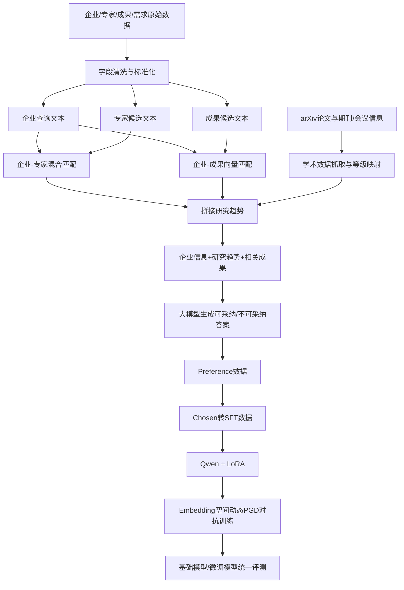

# 企业创新方向预测项目吃透与面试指南

> 适用岗位：大模型算法、NLP 算法、LLM 微调、AI 算法工程师。  
> 建议阅读方式：先掌握第 1～4 章的项目主线，再理解第 5～8 章的训练原理，最后用第 10～12 章做面试模拟。

---

## 0. 先记住项目的一句话

这个项目不是传统意义上的“预测一个标签”，而是一个**带外部知识条件的企业研发方向生成任务**：

> 输入企业画像、学术研究趋势和相关科研成果，使用领域微调后的大模型，生成企业未来 2～3 年值得投入的研发方向，并为每个方向给出战略价值和可执行技术路线。

项目的核心链路是：

1. 清洗企业、专家、科研成果和需求数据。
2. 将企业与专家、科研成果进行语义匹配。
3. 把匹配结果组装成“企业信息 + 研究趋势 + 相关成果”。
4. 使用大模型构造“可采纳 / 不可采纳”预测数据。
5. 将可采纳答案转换为 SFT 数据，对 Qwen 做 LoRA 微调。
6. 在词嵌入空间加入动态 PGD 对抗训练，提高模型鲁棒性。
7. 使用 PPL、BLEU、ROUGE、BERTScore 和语义相似度进行训练前后评测。

---

## 1. 面试时如何介绍项目

### 1.1 30 秒版本

> 这是一个面向企业技术创新规划的领域大模型项目。输入是企业业务画像、外部学术趋势和相关科研成果，输出是企业未来 2～3 年可以落地的研发方向、战略价值及技术路线。我主要负责多源数据清洗和语义匹配、领域指令数据构建，以及 Qwen 的 LoRA 微调和动态对抗训练。训练中，我在 embedding 空间用多步 PGD 生成扰动，并根据标准损失和对抗损失的梯度范数比动态调整扰动半径。最后使用 PPL、BLEU、ROUGE 和语义相似度评估微调前后的生成效果。

### 1.2 2 分钟版本

> 项目想解决的问题是，企业很难直接从大量论文、专家研究方向和科研成果中判断哪些技术适合自己的业务。我们先对企业、专家和成果数据做字段标准化、缺失值处理和文本清洗，然后把企业经营范围、行业分类等字段拼成企业查询文本，把专家研究领域或成果标题、应用场景等字段拼成候选文本。
>
> 匹配阶段使用中文 SentenceTransformer 生成向量。企业与成果主要按照余弦相似度检索；企业与专家在语义向量相似度之外，还加入了基于 jieba 和 TF-IDF 的关键词相关度，降低只有语义相近但技术方向不一致的问题。匹配结果再被拼接成企业信息、研究趋势和相关成果三个输入字段。
>
> 数据构建阶段通过大模型同时生成“可采纳预测”和“不可采纳预测”，其中可采纳预测必须同时结合企业业务、学术趋势和科研成果，并按方向、战略价值、技术路线输出。当前训练链路取 chosen 作为 SFT 标签，而 rejected 保留为后续 DPO 数据。
>
> 训练阶段基于 Qwen 和 LoRA，只更新注意力与 MLP 投影层的低秩参数。我进一步在输入 embedding 上做多步 PGD 对抗训练，并用上一优化步中 CE 梯度与对抗梯度的范数比计算 gamma，再通过 tanh 动态调整 epsilon，避免固定扰动在训练早期过强或后期过弱。评测阶段统一比较基础模型与 LoRA 模型的 PPL、BLEU、ROUGE、BERTScore 和语义相似度。

### 1.3 面试中必须主动澄清的口径

- “Innovation Prediction”是项目名称，任务实际是**条件文本生成**，不是时间序列预测或二分类。
- 仓库已经生成 chosen/rejected 字段，但当前训练脚本做的是 **SFT**，尚未真正执行 DPO。
- “动态对抗训练”的动态部分主要指扰动半径 `eps_t` 随梯度范数比变化，而不是动态修改 LoRA 秩。
- 评测中的 BLEU/ROUGE 衡量字面重叠，不能等价为业务正确率；仍需人工评价或大模型裁判补充。

---

## 2. 项目整体架构



### 2.1 目录职责

| 目录 | 主要职责 | 面试关键词 |
|---|---|---|
| `data_process/` | 清洗、格式转换、实体匹配、偏好/SFT 数据构造 | 数据治理、向量检索、TF-IDF、Prompt 数据 |
| `arxiv_process/` | arXiv 抓取、CAS/JCR/CCF 映射 | 外部知识、学术数据标准化 |
| `lora_training/` | SFT Dataset、LoRA、动态 PGD 对抗训练 | Assistant-only Loss、LoRA、PGD、梯度累积 |
| `model_eval/` | 生成、PPL、BLEU/ROUGE、BERTScore、语义评测 | 离线评测、多维指标、前后对照 |

---

## 3. 第一步：数据到底是怎么来的

### 3.1 原始实体

项目主要使用四类业务实体：

- 企业：企业名称、经营范围、行业大类/中类、业务描述。
- 专家：姓名、研究方向、应用领域。
- 科研成果：成果标题、成果分析、应用场景、主要功能、优势、产业链标签。
- 企业需求：企业需要解决的问题或希望发展的方向。

外部学术数据包括：

- arXiv 论文标题、摘要、作者、分类。
- CCF 会议/期刊等级。
- CAS/JCR 期刊分区或影响力信息。

### 3.2 为什么需要清洗

这些数据来自 Excel、CSV、JSONL 或外部接口，常见问题包括：

- 同一字段多种命名或格式。
- 中英文标点混用。
- 空字符串、NaN、重复记录。
- 企业经营范围很长，含大量通用词。
- 专家和成果描述粒度不一致。

`normalize_text` 的核心处理包括：

1. 使用 NFKC 统一全角、半角字符。
2. 合并多余空白。
3. 统一中英文分隔符。
4. 过滤不需要的特殊符号。

对应代码：

- `data_process/enterprises_match_achievements.py`
- `data_process/enterprises_match_experts.py`

### 3.3 面试官可能问：为什么 NFKC？

参考回答：

> 同一个文本可能同时出现全角字母、半角字母、兼容字符或不同形式的标点。NFKC 会把兼容字符归一化，降低“视觉相同但 Unicode 不同”导致的分词和 embedding 差异。不过它可能改变部分特殊字符语义，所以不能无脑用于公式、化学式等精确文本，本项目主要是企业和技术描述，风险相对可控。

---

## 4. 第二步：企业为什么能匹配到专家和成果

## 4.1 企业查询文本怎么构造

企业不是直接用一个名称去搜索，而是把多个字段拼接成查询文本。

企业到成果的查询字段包括：

```text
org_name + business + category + category_big + category_middle
```

企业到专家的查询字段主要包括：

```text
business + category + category_big + category_middle
```

成果文本由以下字段组合：

```text
title + analyse_contect + application + application_field_scenario
+ main_function + main_advantage + scene_label + chain_label
```

专家文本由以下字段组合：

```text
research_field + application
```

### 4.2 企业与成果：向量余弦相似度

使用中文 SentenceTransformer 将企业文本和成果文本编码为向量：

```text
q   = Encoder(企业文本)
d_i = Encoder(成果 i 文本)
```

归一化后计算余弦相似度：

```text
s_i = (q · d_i) / ( |q| * |d_i| )
```

实现要点：

- 成果向量预先编码并缓存为 `.npy`。
- 缓存名加入成果文本 MD5 和模型名，避免错误复用。
- 成果向量常驻 CPU，按 4096 条分块移动到 GPU。
- 企业按 1024 条批量编码，再逐条进行 Top-K 检索。
- 优先使用主阈值；无结果时降低到次阈值。

对应代码：`data_process/enterprises_match_achievements.py`

### 4.3 企业与专家：语义向量 + TF-IDF 关键词融合

专家匹配除向量相似度外，还使用 jieba 分词和 TF-IDF 关键词分数。

向量相似度先从 `[-1, 1]` 映射到 `[0, 1]`：

```text
s_sem = (cos + 1) / 2
```

最终分数（alpha = keyword_alpha = 0.2）：

```text
final = (1 - alpha) * s_sem + alpha * s_kw
```

仓库默认：

```text
keyword_alpha = 0.2
```

即 80% 语义相似度 + 20% 关键词相关度。

为什么要加 TF-IDF：

- embedding 擅长召回语义近似内容。
- 对技术领域中的关键术语、材料名、算法名，精确词命中仍然重要。
- 两者融合可以减少“语义听起来相关，但具体技术方向不一致”的误召回。

对应代码：`data_process/enterprises_match_experts.py`

### 4.4 为什么不用 FAISS

参考回答：

> 当前实现面向中小规模数据，分块矩阵乘已经足够直接，并且便于做阈值分析和结果回溯。如果成果量达到百万级，遍历全部候选的复杂度是 O(ND)，延迟和显存搬运都会成为瓶颈，届时会使用 FAISS、Milvus 或 pgvector 建立 ANN 索引，并保留小规模精排阶段。

### 4.5 为什么需要缓存 embedding

成果和专家库变化频率通常低于企业查询频率。如果每次匹配都重算候选库 embedding，会浪费大量时间。缓存后只需编码新的企业查询，并进行相似度计算。

### 4.6 匹配结果如何进入模型输入

`data_process/append_matches_to_inputs.py` 负责：

1. 按 `enterprise_index` 聚合专家的 `application` 字段，写入 `research_field`。
2. 聚合成果标题和分析内容，写入 `achievement`。
3. 只保留 `research_field` 和 `achievement` 都非空的企业样本。

最终单条输入包含：

```json
{
  "company_info": "企业业务与行业画像",
  "research_field": "匹配专家对应的研究趋势",
  "achievement": "匹配科研成果"
}
```

---

## 5. 第三步：偏好数据与 SFT 数据如何构建

## 5.1 为什么同时生成可采纳和不可采纳答案

单纯让大模型生成正确答案，难以显式表达“什么是差答案”。项目通过同一输入生成：

- `chosen`：强相关、可执行、有商业价值的研发方向。
- `rejected`：宽泛、过时、与业务无关或不可落地的方向。

这种形式可以支持：

- 当前项目中的 SFT：只取 `chosen` 作为目标答案。
- 后续 DPO/ORPO：直接利用 `chosen` 和 `rejected` 学习偏好。

对应代码：`data_process/generate_preference_dataset.py`

### 5.2 Prompt 的三层约束

正确答案必须同时结合：

1. 企业信息：定义应用场景和战略需求。
2. 学术趋势：定义宏观技术方向。
3. 相关成果：提供具体技术抓手。

输出结构：

```text
【方向一】研发方向名称
【战略价值】为什么适合企业、为什么有商业价值
【技术路线】1. ...；2. ...；3. ...
```

### 5.3 Preference 如何转 SFT

`data_process/preference_to_sft.py` 将：

```json
{
  "instruction": "...",
  "input": "...",
  "chosen": "...",
  "rejected": "..."
}
```

转换为：

```json
{
  "system": "领域系统提示词",
  "instruction": "任务描述",
  "input": "企业信息、趋势与成果",
  "output": "chosen"
}
```

### 5.4 面试官可能问：这算真正的偏好学习吗

参考回答：

> 数据格式具备偏好学习条件，但仓库当前实际训练链路只把 chosen 转成 SFT output，没有使用 rejected 计算 DPO loss。因此准确说法是“构建了偏好数据，并在当前版本中先完成 SFT”，不能直接说已经做了 DPO。下一阶段可以用相同数据接 DPO Trainer，并与纯 SFT 做消融。

---

## 6. 第四步：SFT Dataset 为什么只训练 Assistant

对应代码：`lora_training/dataset.py`

## 6.1 对话构造

每条记录被构造成：

```text
system: 角色与输出要求
user: instruction + input
assistant: output
```

再用 Qwen Chat Template 转为完整文本。

### 6.2 为什么只 tokenize 一次完整文本

完整对话只 tokenize 一次，可以减少 prompt 和 output 分开 tokenize 时的边界差异。

但为了确定 assistant 从哪里开始，代码会额外 tokenize 一次“不含 assistant 答案的 prompt”：

```python
prompt_text = tokenizer.apply_chat_template(
    prompt_messages,
    tokenize=False,
    add_generation_prompt=True,
)
```

### 6.3 Label Mask

模型输入是完整对话，labels 初始等于 input_ids：

```python
labels = input_ids.clone()
```

然后屏蔽 system 和 user：

```python
labels[:prompt_len] = -100
```

CrossEntropyLoss 默认忽略 `-100`，所以只对 assistant 答案计算 loss。

### 6.4 为什么不能让 prompt 也参与 loss

参考回答：

> 目标是学习“给定指令后如何回答”，而不是让模型背诵 system 和 user 文本。屏蔽 prompt 可以把梯度集中在目标输出上，也避免不同输入长度对 loss 产生额外权重。不过在继续预训练任务中通常会对所有 token 计算 loss，二者目标不同。

### 6.5 动态 Padding

`collate_fn` 按当前 batch 的最长样本进行 padding：

- `input_ids` 用 `pad_token_id` 补齐。
- `attention_mask` 用 0 补齐。
- `labels` 用 -100 补齐。

这比统一 padding 到 `max_length` 更节省计算。

---

## 7. 第五步：LoRA 到底做了什么

## 7.1 全参数微调的问题

对于权重矩阵：

```text
W 形状: (d_out, d_in)      # 一个权重矩阵
```

全参数微调直接更新 W，参数量、优化器状态和显存开销都很大。

LoRA 冻结 W，只学习一个低秩增量：

```text
ΔW = B * A
A 形状: (r, d_in)
B 形状: (d_out, r)
```

前向传播变为：

```text
y = W*x + (alpha / r) * B * A * x
```

当 `r` 远小于模型隐藏维度时，可训练参数显著减少。

## 7.2 项目 LoRA 配置

`lora_training/config.yaml`：

```yaml
r: 8
lora_alpha: 16
dropout: 0.05
target_modules:
  - q_proj
  - k_proj
  - v_proj
  - o_proj
  - gate_proj
  - up_proj
  - down_proj
```

覆盖：

- Attention：Q/K/V/O 投影。
- MLP：Gate/Up/Down 投影。

### 7.3 r、alpha、dropout 如何解释

- `r`：低秩空间容量。越大表达能力越强，但参数和显存增加。
- `alpha`：缩放系数。实际缩放通常为 `alpha/r`。
- `dropout`：只施加于 LoRA 分支，减少小数据过拟合。

### 7.4 为什么不只训练 q_proj 和 v_proj

参考回答：

> 只训练 q/v 参数更少，常用于轻量适配；本任务输出格式较长，还需要学习较明显的领域表达和技术路线结构，因此同时覆盖 attention 和 MLP 投影，提高适配容量。代价是参数量和训练时间增加，所以需要通过消融比较不同 target modules。

---

## 8. 第六步：动态对抗训练是项目最重要的算法亮点

对应代码：

- `lora_training/trainer.py`
- `lora_training/adv.py`

## 8.1 为什么做对抗训练

企业文本中可能存在：

- 同义改写。
- 字段噪声或缺失。
- 匹配到的成果存在轻微偏差。
- 输入表达顺序变化。

如果模型只拟合干净训练样本，输入发生小扰动时输出可能不稳定。对抗训练在最坏方向加入受限扰动，要求模型在邻域内也保持正确输出。

## 8.2 为什么扰动 embedding 而不是 token

token 是离散变量，无法直接做梯度上升；embedding 是连续可微向量，因此可以沿梯度方向寻找最坏扰动。

设原始 embedding 为 E，扰动为 δ：

```text
E_adv = E + δ
```

约束：

```text
|δ|_2 <= ε_t          # 扰动的 L2 范数不超过 ε_t
```

## 8.3 PGD 如何生成扰动

随机初始化：

```text
δ_0 ~ Uniform(-ε_t, ε_t)     # 每维在 [-ε_t, ε_t] 均匀随机
```

每一步沿对抗 loss 对 δ 的梯度上升：

```text
δ_{k+1} = 投影到L2球内( δ_k + α * (∇_δ L_adv) / |∇_δ L_adv|_2 )
```

其中：

- α 是单步攻击步长。
- K 是 PGD 步数。
- Π 表示投影回 L2 球。

`project_onto_l2_ball` 的逻辑：

1. 将每个样本的 δ 展平。
2. 计算每个样本的 L2 范数。
3. 若范数超过 ε，则乘 `ε/norm` 缩小。
4. 未超出则保持不变。

## 8.4 为什么保存 loss 最大的 delta

PGD 中间步骤不保证最后一步一定对应最大 loss。项目记录整个 K 步中 loss 最大的扰动，用它计算最终对抗梯度，更符合“近似寻找局部最坏样本”的目标。

## 8.5 动态 epsilon 如何计算

项目使用上一优化步的 CE 与 Adv 梯度范数比：

```text
gamma_t = |g_ce^{t-1}|_2 / ( |g_adv^{t-1}|_2 + eta )   # 上一步 CE 与 Adv 梯度范数比
```

训练前期 warmup：

```text
ε_t = ε_max * ( t / T_warmup )
```

warmup 后：

```text
ε_t = ε_max * tanh(gamma_t)
```

直觉解释：

- CE 梯度相对大，说明标准任务仍主导，可以适当增加扰动强度。
- Adv 梯度相对大，说明对抗目标已经很强，应抑制 ε。
- `tanh` 将数值平滑限制在 `(0, 1)`，避免梯度比异常导致 ε 爆炸。

## 8.6 为什么不用 `loss = ce + lambda * adv` 直接 backward

项目需要分别得到 CE 梯度范数和 Adv 梯度范数来更新下一步 γ，因此：

```python
ce_grads = torch.autograd.grad(ce_loss, trainable)
adv_grads = torch.autograd.grad(adv_loss_final, trainable)
```

然后手动累加到 `p.grad`：

```text
g = (1/A) * g_ce + (lambda_adv / A) * g_adv     # A = 梯度累积步数
```

其中 A 是梯度累积步数。

### 8.7 `detach` 的意义

- `embeds.detach()`：不更新词嵌入，只让 LoRA 参数参与优化。
- `g.detach()`：只保存梯度数值，不保留高阶计算图。
- `delta.detach()`：每次 PGD 更新后切断旧图，防止 K 步图不断增长。

### 8.8 训练完整流程

```text
1. input_ids -> frozen embedding
2. 计算 gamma_t 与 eps_t
3. 干净样本前向，得到 CE loss 和 CE 梯度
4. 随机初始化 delta
5. K 步 PGD 更新 delta，并保留最大 loss 的 delta
6. 用最大 delta 重新前向，得到 Adv loss 和 Adv 梯度
7. 手工合并 CE/Adv 梯度
8. 达到梯度累积步数后裁剪梯度
9. optimizer.step + scheduler.step
10. 定期验证并保存 best LoRA
```

---

## 9. 第七步：模型如何评测

对应代码：

- `model_eval/evaluator.py`
- `model_eval/generation_metrics.py`
- `model_eval/utils.py`

## 9.1 PPL

只对参考答案部分计算 loss：

```text
PPL = exp(L_CE)
```

PPL 越低，表示模型认为参考答案越可能出现。

局限：

- PPL 低不代表生成内容一定更有商业价值。
- 不同 tokenizer、模板或截断长度下 PPL 不宜直接横向比较。

## 9.2 BLEU

BLEU 衡量生成文本和参考文本的 N-gram 精确率，偏向“模型生成的内容有多少出现在参考答案中”。

局限：同一个研发方向可以有多种正确表达，BLEU 会低估语义相同但措辞不同的答案。

## 9.3 ROUGE

ROUGE 关注参考答案内容被生成结果覆盖的程度：

- ROUGE-1：一元词覆盖。
- ROUGE-2：二元词覆盖。
- ROUGE-L：最长公共子序列。

## 9.4 BERTScore

分别编码 prediction 与 reference 中 token 的上下文表示，通过最大余弦相似度计算 precision、recall、F1。比 BLEU/ROUGE 更能容忍同义表达。

## 9.5 Embedding 语义相似度

项目使用 Qwen Embedding 模型分别编码生成答案与参考答案，并计算余弦相似度：

```text
sim = (e_pred · e_ref) / ( |e_pred| * |e_ref| )
```

## 9.6 为什么不能只看一个指标

- PPL：模型对参考答案的概率。
- BLEU/ROUGE：字面重叠。
- BERTScore/Embedding：语义接近程度。
- 格式遵循率：是否按方向/战略价值/技术路线输出。
- 人工评估：相关性、可行性、前瞻性和事实正确性。

面试推荐回答：

> 生成任务不存在单一完美指标。我会将自动指标作为离线回归测试，再抽样做人工评分；如果数据规模变大，还可以用独立强模型做 LLM-as-a-Judge，但必须控制提示词偏差和评审模型自偏好。

---

## 10. 实验结果与正确表述

## 10.1 本次可复现实验环境

由于 NV-H20 隔离环境缺少原始数据、Qwen2.5-0.5B 和部分依赖，本次补充实验采用：

- 模型：Qwen3-1.7B。
- 训练方式：手写 LoRA + 项目同构的动态 PGD 对抗训练。
- 数据：领域模板生成的任务同构种子数据。
- 划分：720 train / 90 val / 120 test；测试行业不出现在训练中。
- LoRA：8.72M 可训练参数，占 1.72B 模型约 0.51%。
- 硬件：单卡 NVIDIA H20。
- 训练：270 optimizer steps，约 22 分钟。

结果：

| 指标 | Base | LoRA + 动态对抗训练 |
|---|---:|---:|
| PPL | 16.72 | 14.65 |
| BLEU-4 | 0.18 | 28.36 |
| 格式：包含方向一 | 11.7% | 100% |
| 格式：包含战略价值 | 0% | 100% |
| 格式：包含技术路线 | 0% | 100% |

训练过程：

- CE loss：约 2.60 -> 0.02。
- Adv loss：约 2.60 -> 0.03。
- 动态 ε：warmup 后主要在约 0.19～0.29 波动。
- 最优验证 loss：约 0.019。

## 10.2 面试中怎么说

推荐：

> 我先在同构种子数据上验证训练链路和算法有效性，测试行业按行业维度留出。LoRA 加动态对抗训练后，PPL 从 16.72 降到 14.65，BLEU-4 从 0.18 提升到 28.36，输出格式遵循率达到 100%。这些结果主要说明模型学会了领域输出协议；要证明对抗训练本身的独立增益，还需要补“纯 LoRA vs LoRA+对抗”的消融实验。

不推荐：

- 不要说这些指标来自真实线上企业数据。
- 不要把 BLEU/ROUGE 称为准确率。
- 没有纯 LoRA 对照时，不要把所有增益都归因于对抗训练。

---

## 11. 仓库当前的技术风险与改进方向

这一章很重要。面试官问“项目有什么不足”，不能只回答“数据少”。

### 11.1 偏好数据尚未真正用于偏好优化

现状：生成了 `chosen/rejected`，但 `preference_to_sft.py` 只保留 chosen。

改进：

- 先用 SFT 学任务和格式。
- 再用 DPO/ORPO 优化“可采纳答案优于不可采纳答案”的偏好。
- 比较 SFT、SFT+DPO 的相关性和人工评分。

### 11.2 缺少纯 LoRA 消融实验

当前 base vs post 同时包含 SFT 和对抗训练两个变化，无法严格证明动态对抗训练的独立贡献。

至少需要：

| 实验 | LoRA | 固定 ε 对抗 | 动态 ε 对抗 |
|---|---|---|---|
| Base | 否 | 否 | 否 |
| SFT-LoRA | 是 | 否 | 否 |
| Fixed-AT | 是 | 是 | 否 |
| Dynamic-AT | 是 | 否 | 是 |

### 11.3 企业-成果与企业-专家分数口径不一致

- 成果匹配直接使用余弦相似度阈值。
- 专家匹配将余弦从 `[-1,1]` 映射到 `[0,1]` 后再与 TF-IDF 融合。

因此两边的 `0.8` 阈值不可直接比较，应在标注验证集上分别调参。

### 11.4 成果匹配注释与实现有差异

文件说明提到“向量相似度与文本相关度融合”，但当前成果匹配核心代码实际上主要使用向量余弦相似度；文本相关度融合主要出现在专家匹配中。

面试时应按真实代码回答，不要照文件头注释夸大。

### 11.5 Prompt 一致性问题

训练 Dataset 使用：

```text
instruction + "\n" + input
```

评测 PPL 和生成部分使用：

```text
instruction + "\n\n输入：\n" + input
```

模板差异会影响 PPL 和生成结果。严格实验应抽取统一的 `build_messages()` 函数，让训练和评测共用。

### 11.6 中文评测配置需要校正

`model_eval/eval_config.yaml` 默认：

```yaml
language: "en"
```

任务主要是中文，应根据 BERTScore 模型与实现改为合适的中文配置，或明确指定多语模型。

### 11.7 SemanticEvaluator 写死 CUDA

`SentenceTransformer(..., device="cuda")` 在无 GPU 环境会失败。应根据 `torch.cuda.is_available()` 自动选择设备。

### 11.8 只开启 BERTScore 时可能缺少 prediction

生成阶段只在 BLEU/ROUGE 或 Semantic 开启时执行。如果只开启 BERTScore，结果中可能没有 prediction。应将 BERTScore 也加入生成条件。

### 11.9 梯度范数是近似值

当前梯度累积期间记录的是各 micro-batch 梯度范数平方和再开根号：

```text
sqrt( Σ_i |g_i|^2 )          # 各 micro-batch 梯度范数平方和，再开根号
```

它不等于累积梯度总和的真实范数：

```text
| Σ_i g_i |                  # 先求和，再取范数
```

因为忽略了梯度之间的交叉项。项目中应将它描述为“梯度敏感度近似”，而不是精确的累计梯度范数。

### 11.10 日志 loss 是最后一个 micro-batch

`ce_loss_val` 和 `adv_loss_val` 在梯度累积期间不断覆盖，optimizer step 时记录的是最后一个 micro-batch 的 loss，不是整个 accumulation window 的平均值。若要画更稳定的曲线，应累加并求平均。

### 11.11 空 batch 与尾 batch

- Assistant 被完全截断时 Dataset 返回 None。
- 如果一个 batch 全是 None，`collate_fn` 返回空 dict，训练代码会访问不存在的 `input_ids`。
- DataLoader 使用 `drop_last=True`，不足一个 batch 的尾数据被丢弃。
- 训练结束时，不足一个梯度累积窗口的梯度也被主动丢弃。

可以通过预过滤、空 batch 跳过、正确处理最后一个 accumulation window 改进。

---

## 12. 面试题库与参考回答

## 12.1 业务与任务

### Q1：这个项目解决什么问题？

> 帮助企业把自身业务画像与外部技术趋势、科研成果关联起来，生成未来 2～3 年具有战略价值和可落地技术路线的研发方向，降低企业从海量学术信息中做技术判断的成本。

### Q2：为什么说它不是传统预测？

> 输出不是一个标签或连续数值，而是一段包含多个研发方向、战略解释和实施步骤的结构化文本。因此建模上属于条件生成，名称中的预测是业务含义。

### Q3：为什么不直接用通用大模型？

> 通用模型容易给出“数字化、智能化”这类泛化建议，不能稳定融合企业业务、学术趋势和具体成果，也不一定遵循固定结构。领域 SFT 用于学习输入关联和输出协议。

## 12.2 数据与检索

### Q4：企业与成果如何匹配？

> 将企业多字段组合为查询文本，成果多字段组合为候选文本，用中文 SentenceTransformer 编码，归一化后计算余弦相似度，通过阈值过滤和 Top-K 返回结果；成果向量有缓存，并按块移动到 GPU 控制显存。

### Q5：专家匹配为什么加入 TF-IDF？

> embedding 能捕捉语义，但技术名词精确命中也很重要。TF-IDF 能提高稀有领域词的权重，两者加权可以兼顾语义召回和术语精度。

### Q6：阈值 0.73/0.8 怎么来的？

稳妥回答：

> 当前主要根据分数分布和人工抽样设定，是经验阈值。更规范的做法是构造标注匹配集，在 precision、recall 或业务 Top-K 命中率上调参，不能把经验阈值说成理论最优。

### Q7：数据泄漏怎么避免？

> 应按企业或行业维度划分，而不是把同一企业的改写样本随机拆到训练和测试中；外部成果也要考虑时间截断，避免用未来论文预测过去方向。

## 12.3 SFT 与 LoRA

### Q8：为什么只训练 assistant token？

> system 和 user 是条件，不是模型需要预测的目标。用 -100 mask prompt，可以把 loss 聚焦到回答部分，避免模型学习复述输入。

### Q9：LoRA 为什么省显存？

> 冻结基础权重，只存低秩 A/B 参数及其梯度和优化器状态。参数量从 `d_out*d_in` 降为 `r*(d_in+d_out)`。

### Q10：为什么选择 r=8、alpha=16？

> r=8 是参数效率和适配容量的折中，alpha/r=2 提供适度缩放。严格来说需要用 r=4/8/16 等做消融，而不是声称 8 一定最优。

### Q11：SFT 和 DPO 有什么区别？

> SFT 最大化 chosen 答案的似然；DPO 同时利用 chosen/rejected，直接提高 chosen 相对于 rejected 的偏好概率。当前项目实现了 SFT，数据具备继续做 DPO 的条件。

## 12.4 对抗训练

### Q12：为什么动态 epsilon？

> 固定 ε 无法适应训练阶段变化。训练早期模型尚未学会任务，过强扰动可能破坏收敛；后期如果扰动过小又起不到正则化作用。因此先 warmup，再根据 CE 与 Adv 梯度强弱自适应调整。

### Q13：gamma 的直觉是什么？

> 它衡量标准任务梯度相对于对抗梯度的强弱。如果 CE 梯度更强，说明仍有空间增加扰动；如果 Adv 梯度过强，就降低相对扰动，避免对抗目标压过主任务。

### Q14：为什么加 tanh？

> 梯度比可能很大，直接乘 epsilon_max 会越界。tanh 单调、平滑并限制在 0～1，既保留相对关系，又保证扰动半径不超过上限。

### Q15：PGD 为什么比 FGSM 强？

> FGSM 只沿一次梯度方向更新，计算便宜但攻击能力有限；PGD 多步更新并投影回约束集合，更接近局部最坏扰动，但训练成本更高。

### Q16：embedding 扰动是否一定对应真实文本？

> 不一定。它主要是在表示空间做局部平滑正则，提升模型对轻微语义或表示变化的稳定性。若要求可读扰动，需要同义改写、字符扰动或离散文本攻击补充验证。

### Q17：为什么 CE/Adv 梯度要分别算？

> 动态 ε 依赖两路梯度范数，必须分别提取；之后再按梯度累积比例合并到参数梯度中。

### Q18：项目中的梯度范数是精确的吗？

> 单个 micro-batch 是精确的；梯度累积窗口用各 micro-batch 范数平方和开根号近似，忽略了梯度方向交叉项。后续可在累积完成后直接对 `p.grad` 计算真实范数。

## 12.5 评测与实验

### Q19：为什么 BLEU/ROUGE 提升很多？

> 基础模型不熟悉项目的固定输出结构，微调后学会了方向、战略价值和技术路线的模板，所以字面指标与格式遵循率会明显提升。这不等于业务正确性同幅提升，仍需人工或语义评测。

### Q20：PPL 下降说明什么？

> 模型对测试集参考答案赋予了更高概率，说明领域分布适配改善。但 PPL 受模板、tokenizer 和截断方式影响，不能跨不同设置直接比较。

### Q21：怎么证明对抗训练有效？

> 目前 base vs post 还不够，需要纯 LoRA、固定 ε 和动态 ε 三组消融，并在干净测试集和扰动测试集上比较。最好报告均值、方差和多随机种子结果。

### Q22：如果结果变差怎么排查？

1. 检查训练与评测 Chat Template 是否一致。
2. 检查 prompt mask 边界是否正确。
3. 看 epsilon 是否过大、Adv loss 是否压过 CE。
4. 检查数据截断是否导致 assistant 全部丢失。
5. 检查 LoRA target modules 和学习率。
6. 分析生成样本，而不是只看平均指标。

## 12.6 工程与性能

### Q23：训练如何节省显存？

> LoRA、bf16、梯度累积、gradient checkpointing、动态 padding、SDPA/FlashAttention，以及只保留当前 batch 的 embedding 和扰动。

### Q24：为什么 `use_reentrant=False`？

> 项目使用 `torch.autograd.grad` 分别提取梯度。非 reentrant checkpointing 对这种用法兼容性更好，也支持更多 autograd 模式。

### Q25：为什么成果 embedding 放 CPU、按块搬 GPU？

> 避免候选库全部占据显存。代价是产生 CPU-GPU 传输开销，规模更大时应改为向量数据库或 ANN 索引。

---

## 13. 面试官连续追问示例

### 追问链一：动态对抗训练

```text
你做了什么？
-> embedding 空间 K 步 PGD + 动态 epsilon。

为什么动态？
-> 固定扰动不能适应训练阶段变化。

动态依据是什么？
-> 上一步 CE/Adv 梯度范数比 gamma。

为什么用上一步？
-> 当前 eps 要在当前对抗样本生成前确定，使用上一步统计避免循环依赖。

为什么 tanh？
-> 平滑限幅，保证 eps 不超过 eps_max。

怎么证明有效？
-> 补纯 LoRA、固定 epsilon、动态 epsilon 消融与扰动集评测。
```

### 追问链二：企业匹配

```text
为什么不用关键词搜索？
-> 企业和成果表达存在同义词，纯关键词召回不足。

为什么还加 TF-IDF？
-> embedding 对具体技术名词可能不够敏感。

为什么成果匹配没加？
-> 当前代码主要完成向量版本，是可改进点；面试不能假装已实现。

数据规模变大怎么办？
-> ANN 召回 + Cross Encoder/规则精排。
```

### 追问链三：指标

```text
BLEU 很高说明模型好吗？
-> 只说明字面和格式更接近参考答案。

语义正确怎么判断？
-> BERTScore/embedding + 人工维度评分。

商业价值怎么判断？
-> 专家评价相关性、可行性、前瞻性、可执行性。

如何保证评测公平？
-> 同一数据、同一模板、同一生成参数，按企业/行业去重划分。
```

---

## 14. 简历版本

### 企业技术创新方向预测大模型｜实验室科研项目

- 面向企业未来 2～3 年技术创新方向预测，搭建“多源数据处理—领域数据构建—大模型微调—效果评测”链路，融合企业画像、学术趋势与科研成果，生成研发方向、战略价值及技术路线。
- 完成企业、专家和科研成果等多源数据清洗与语义匹配，结合 SentenceTransformer 向量检索与 TF-IDF 关键词融合构建企业相关研究趋势和成果上下文。
- 设计“可采纳/不可采纳”对比式数据构建方案，实现 ChatML 格式转换、Assistant-only Loss、动态 Padding 和长文本截断，形成可用于 SFT/DPO 的领域数据。
- 基于 Qwen 实现 LoRA 微调，在 embedding 空间引入多步 PGD 对抗训练，并根据标准/对抗梯度范数比动态调节扰动半径，提高训练稳定性与输入鲁棒性。
- 在单卡 H20 的同构种子数据实验中，PPL 由 16.72 降至 14.65、BLEU-4 由 0.18 提升至 28.36，结构化输出格式遵循率提升至 100%。

---

## 15. 自测清单

如果下面问题不能脱稿回答，说明还没有真正吃透。

### 业务

- [ ] 能否用一句话解释输入、输出和业务价值？
- [ ] 能否解释为什么项目名是预测、技术上却是生成？
- [ ] 能否说出通用模型直接生成的主要问题？

### 数据

- [ ] 能否画出企业、专家、成果进入训练数据的完整数据流？
- [ ] 能否解释企业-成果和企业-专家匹配的区别？
- [ ] 能否解释 embedding 缓存、分块计算和阈值回退？
- [ ] 能否说明怎样避免企业级或行业级数据泄漏？

### 训练

- [ ] 能否手写 LoRA 的核心公式？
- [ ] 能否解释 Assistant-only Loss 的 mask 边界？
- [ ] 能否解释 PGD 的更新与 L2 投影？
- [ ] 能否解释 gamma、epsilon warmup 和 tanh？
- [ ] 能否解释为什么分别调用 `autograd.grad`？
- [ ] 能否指出当前梯度范数只是累积窗口近似？

### 评测

- [ ] 能否说明 PPL、BLEU、ROUGE、BERTScore 的差异？
- [ ] 能否说明为什么自动指标不等于业务正确率？
- [ ] 能否设计纯 LoRA、固定 ε、动态 ε 的消融实验？

### 诚实口径

- [ ] 能否明确当前训练是 SFT，而不是 DPO？
- [ ] 能否明确补充实验使用的是同构种子数据？
- [ ] 能否明确 base vs post 不能单独证明对抗训练贡献？

---

## 16. 建议的下一步改造

按对求职价值的优先级排序：

1. 补纯 LoRA、固定 ε、动态 ε 三组消融实验。
2. 统一训练与评测的 Chat Template 和 `build_messages()`。
3. 把 chosen/rejected 接入 DPO，并与 SFT 做对照。
4. 增加格式正确率、企业相关性、可行性、前瞻性人工评分。
5. 为匹配模块构建人工标注集，报告 Precision@K、Recall@K、MRR。
6. 将路径、阈值、模型名全部移入统一配置文件。
7. 增加单元测试，覆盖空 batch、超长 prompt、无匹配结果和缓存失效。
8. 数据规模扩大后，引入 FAISS/Milvus 召回和 Cross Encoder 精排。

完成前 3 项后，这个项目就能从“能讲的科研项目”升级为“有严谨实验闭环的大模型算法项目”。
